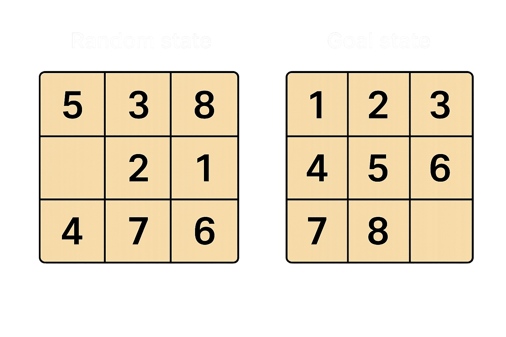

# Problem

## Description

The 8-puzzle is a classic problem in artificial intelligence and search algorithms. It consists of a 3x3 grid containing 8 numbered tiles and one empty space. The tiles are numbered from 1 to 8, and the empty space is typically represented by 0 or a blank.



## Objective

The goal is to rearrange the tiles by sliding them into the empty space, one move at a time, to reach a predefined goal state.

You can only move tiles that are adjacent (up, down, left, right) to the empty space.

## Actions

- Move up
- Move down
- Move left
- Move right

Each move swaps the blank space with a neighboring tile.

## Search Problem Definition

- **State**: a configuration of the 3x3 board.
- **Initial state**: any valid arrangement of the tiles.
- **Goal state**: the ordered configuration.
- **Actions**: slide a tile into the empty space.
- **Path cost**: usually 1 per move.
- **Solution**: a sequence of moves that transforms the initial state into the goal state.

## Algorithms Commonly Used

- Breadth-First Search (BFS)
- Depth-First Search (DFS)
- A* Search (with heuristics like Manhattan distance or misplaced tiles)
- Greedy Best-First Search

## Project Structure

This project is organized into two main folders: `src` for the application's source code and `tests` for unit and integration tests.

Below, you can see the project's directory tree:

```
my_project/
├── src/
│   ├── __init__.py
│   ├── puzzle.py
│   ├── heuristic.py
│   └── main.py
└── tests/
    ├── __init__.py
    ├── calculates_cost.py
    └── is_the_puzzle_solvable.py
```

### Folder and File Details:

  * **`src/`**: Contains the core of the application.

      * **`__init__.py`**: This empty file marks `src` as a Python package, enabling imports from its modules.
      * **`puzzle.py`**: Implements the **`Puzzle`** class, which represents the state of the 8-puzzle and its movement operations.
      * **`heuristic.py`**: Contains the implementation of the **A\*** (A-Star) search algorithm and all necessary helper functions for its operation, including the cost heuristic.
      * **`main.py`**: This is the program's entry point. It's responsible for creating a `Puzzle` instance and executing the A\* algorithm to find the solution.

  * **`tests/`**: Houses all project tests.

      * **`__init__.py`**: Marks `tests` as a Python package.
      * **`calculates_cost.py`**: Contains specific tests to verify the cost calculation of puzzle states, ensuring the heuristic function operates correctly.
      * **`is_the_puzzle_solvable.py`**: Includes tests for the functionality that determines if a given puzzle configuration is solvable, ensuring that only valid puzzles are processed.
